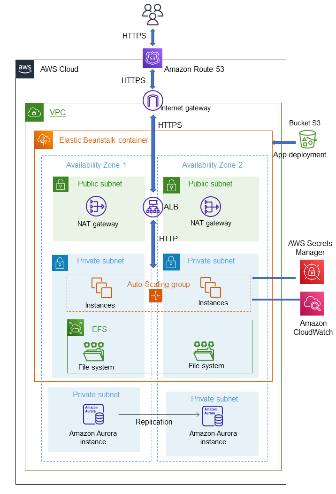

# aws_wordpress
AWS scalable wordpress solution

## 1 - Introduction

In this repository you will find a cloudformation project that deploys an infrastructure based on AWS Beanstalk letting you run a wordpress application.

Within the cftemplate you'll find the cloudformation files, in the root path you have a source bundle ready to deploy and a wordpress folder with 3 injections:

    1- custom wp-config.php
    2- .platform folder
    3- .ebextensions folder

See section HOW TO DEPLOY APP for more details.

## 2 - Architecture

The application is deployed on a 3 Tiers and 2 AZs infrastructure. The DB, EC2 (with the webserver) and EFS belong on private subnets. In the public subnets reside the ALB and NAT GATEAYs. An external S3 bucket is used by Beanstalk to retrieve app informations for the deploy. Secret manager is used to store the DB password If you have a domain in Route53 with a hosted zone, you could put in front of your ALB the DNS resolver. The DB is external to Beanstlk container, this way you can choose Aurora as engine and you can destroy and rebuilt the Beanstalk container without lose your data.



## 3 - Features

### 3.1 - Secure

Both DB and instances are deployed into private subnets. The DB password is automatically generated with cloufromation nad saved in a Secret Manager retrieved by the instances at boot. The communication between internet and ALB is based on HTTPS protocol. The communication EC2-EFS and EC2-DB are secured by security groups. EC2s and DB reach internet through the NAT Gateways, so there is now way that a communication with them is started from internet. The SSH port of the instances is closed, only with a System Mnagaer Session we can login into the webservers. Any updates of the EC2s can managed with System Manager.

### 3.2 - Fast

The ALB let the application scales horizontally and you can choose the EC2s' size that better fit your needs. The DB is a mysql Amazon Aurora Serverless for better performance than a classic mysql. It's use Secret Manager to store the password because secure and faster then IAM.

### 3.3 - Fault tolerant

The use of an ALB with an Autoscaling Group covering 2 AZs ensure fault tollerance. The EC2 share a EFS to store the uploaded files through the web application interface. The DB instances are serverless (so managed by AWS) and deployed on different AZs.

### 3.4 - Adaptive to average load

You can define the min and max of the Autoscaling Group. 2 Cloudwatch alarms based on NetworkOut metric are implemented by Beanstalk by default. The Aurora DB is serverless, so able to adapt the size of its instances automatically.


## 4 - Deploy the infrastructure

Move to cftemplate folder. Inside there is a **root.yaml** and folder **nested**. Upload the yaml files inside the folder **nested** into a bucket S3 in a account where you are able to run cloudformation. The yaml files must reside at the root path of you bucket. In your local PC configure the AWS CLI to access this account.

Run the cloudformation command starting from root.yaml.

> I suggest to first run the basic installation, then update the stack with further features

### 4.1 - Basic installation
This installation deploys a Beanstalk container responding on port 80 (ALB port) and without a custom DNS (no Route53)

Parameters required:
- S3CFNAME = name of the bucket where you saved te cloudformation files

```
aws cloudformation create-stack --stack-name wordpress --template-body file://root.yaml --capabilities CAPABILITY_IAM --parameters ParameterKey=S3CFNAME,ParameterValue=<name of the bucket>
```

### 4.2 - HTTPS installation - self signed certificate
This installation deploys a Beanstalk container responding on port 80 and 443 (ALB ports), without a custom DNS (no Route53) so the https certificate will be invalid

Parameters required:
- S3CFNAME = name of the bucket where you saved te cloudformation files
- SSLCertificateArns = arn of a certificate saved in AWS Certifcate Manager

```
aws cloudformation create-stack --stack-name wordpress --template-body file://root.yaml --capabilities CAPABILITY_IAM --parameters ParameterKey=S3CFNAME,ParameterValue=<name of the bucket> ParameterKey=SSLCertificateArns,ParameterValue=<certificate arn>
```

### 4.3 - HTTPS installation with your domain
This installation deploys a Beanstalk container responding on port 80 and 443 (ALB ports), with a custom DNS (Route53) resolving your ALB. So if the https certificate is associated with your domain, it will be valid. This installation requires that you have a properly configured hosted zone in Route53. An A record associated to your domain it will be defined in your hosted zone.

Parameters required:
- S3CFNAME = name of the bucket where you saved te cloudformation files
- SSLCertificateArns = arn of a certificate saved in AWS Certifcate Manager
- HostedZoneId = Hosted zone ID. You will find in your hosted zone details
- BeanstalkELBHostedZoneId = ELB zone ID specific for each region. From this [link](https://docs.aws.amazon.com/general/latest/gr/elb.html) search the id corresponding to the region where you are deploying the application
- Domain= ROUTE53 domain (no subdomain)

```
aws cloudformation create-stack --stack-name wordpress --template-body file://root.yaml --capabilities CAPABILITY_IAM --parameters ParameterKey=S3CFNAME,ParameterValue=<name of the bucket> ParameterKey=SSLCertificateArns,ParameterValue=<certificate arn> ParameterKey=HostedZoneId,ParameterValue=<hosted zone id> ParameterKey=BeanstalkELBHostedZoneId,ParameterValue=<elb zone id> ParameterKey=Domain,ParameterValue=<route53 domain>
```

### 4.4 - HTTPS installation with your subdomain
This installation deploys a Beanstalk container responding on port 80 and 443 (ALB ports), with a custom DNS subdomain(Route53) resolving your ALB. So if the https certificate is associated with your domain, it will be valid. This installation requires that you have a properly configured hosted zone in Route53. An A record associated to your subdomain it will be defined in your hosted zone.

Parameters required:
- S3CFNAME = name of the bucket where you saved te cloudformation files
- SSLCertificateArns = arn of a certificate saved in AWS Certifcate Manager
- HostedZoneId = Hosted zone ID. You will find in your hosted zone details
- BeanstalkELBHostedZoneId = ELB zone ID specific for each region. From this [link](https://docs.aws.amazon.com/general/latest/gr/elb.html) search the id corresponding to the region where you are deploying the application
- Domain = ROUTE53 domain (no subdomain)
- SubDomain = a string representing your desired subdomain. If you want an A record www.example.com, the subdomain must be www

```
aws cloudformation create-stack --stack-name wordpress --template-body file://root.yaml --capabilities CAPABILITY_IAM --parameters ParameterKey=S3CFNAME,ParameterValue=<name of the bucket> ParameterKey=SSLCertificateArns,ParameterValue=<certificate arn> ParameterKey=HostedZoneId,ParameterValue=<hosted zone id> ParameterKey=BeanstalkELBHostedZoneId,ParameterValue=<elb zone id> ParameterKey=Domain,ParameterValue=<route53 domain> ParameterKey=SubDomain,ParameterValue=<subdomain string>
```

## 5 - Deploy the wordpress application

>You can deploy any wordpress versions that support PHP 8.1.

To deploy your application you can access to the AWS console and under Elatic Beanstalk you will find your environment. The interface provides an easy way to deploy your code: uploading a source bundle. You can find the instruction to prepare a source bundle [here](https://docs.aws.amazon.com/elasticbeanstalk/latest/dg/applications-sourcebundle.html).

In the root path there a source_bunde.zip ready to be deployed to test the environment.

Before creating the source bundle, you have to injects the following files or folders.

### 5.1 - Folder .ebextensions

This folder contains 2 Beanstalk config files:

1- wordpress.config: to set some evironment variables. It's currently not used
2- efs-mount.config: to mount the EFS on the instances. This way the files saved in wp-content/uploads are shared between the instances.

### 5.2 Folder .platform

This folder contains a prebuild hook. The script secret_manager.sh is used to retrieve the secret manager values for the DB connection at the instance boot. It writes a secret.json file in /var/app/current.

### 5.3 File wp-config.php

This is the wordpress configuration file. It's modified to retrieve the DB credentials and informations from the file /var/app/current/sceret.json
